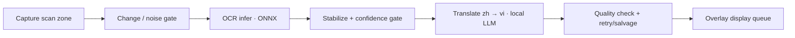

# ScreenSubTranslator

A Qt6 desktop overlay that translates **on-screen Chinese subtitles into Vietnamese in near real time** — fully local. It captures a screen region, runs Chinese OCR (PaddleOCR ONNX, C++), sends each line to a local LLM (llama.cpp / Ollama / any OpenAI-compatible endpoint), and draws the Vietnamese text back over the video.

> Personal hobby project — built to watch films that have no Vietnamese subtitles. Not a commercial product. Priorities are **low latency and smooth playback**, so it deliberately trades some translation polish for speed and simplicity.

## Demo

https://github.com/user-attachments/assets/214c5682-b3bf-4e6d-ba5b-7ff9da1f5a35
> Live Chinese → Vietnamese translation over an unsubtitled film

### Screenshots


## How it works



- **Capture** runs on its own thread and only forwards frames that changed enough (frame-diff + contrast gates), so a static screen costs almost nothing.
- **OCR** runs on its own thread. Leading/trailing characters with low per-character confidence are trimmed (`kOcrEdgeMinConfidence`): dark margins or background that slip into the crop otherwise decode as a stray edge character (typically 嶺) that would leak into the translation. A read is then accepted only after it is stable across a few frames and passes a **per-character confidence gate** (`kMinOcrConfidence`), which drops garbled reads before they reach the model.
- **Stabilization/dedupe** (`ocr_subtitle_filter`) turns noisy per-frame reads into one candidate and avoids re-translating a subtitle that is still on screen.
- **Translation** is async. Each accepted line is turned into a strict prompt (rules + matching glossary + recent Chinese lines). Output goes through candidate selection → sanitize → quality check.
  - On failure, **one retry** runs with looser sampling and an issue-specific hint.
  - If it still fails, a **best-effort salvage** extracts the cleanest Vietnamese fragment instead of dropping the line, so subtitles rarely vanish entirely.
- **Display queue** shows finished lines sequentially with a per-line duration based on length, and clears the overlay when the source subtitle disappears.

The overlay never blocks: capture, OCR, translation and logging all run off the UI thread.

## Source layout

```text
main.cpp                              App entry point
src/
  overlay_window.{h,cpp}              Controller: worker coordination, display queue, owns the two overlay windows
  overlay_frame.{h,cpp}              Base frameless overlay window: drag, edge-resize, right-click menu, geometry signal
  capture_zone_widget.{h,cpp}        Independent OCR capture window (transparent interior, hover outline)
  translation_widget.{h,cpp}         Independent translation window (translucent panel, shadowed subtitle text)
  capture_worker.{h,cpp}             Screen capture thread, change/contrast gate, OCR preprocessing
  ocr_engine.{h,cpp}                 PaddleOCR ONNX Runtime inference (C++)
  ocr_worker.{h,cpp}                 OCR thread; runs the engine, feeds the subtitle filter
  ocr_subtitle_filter.{h,cpp}        Per-frame → stable candidate, dispatch dedupe
  translate_client.{h,cpp}           Async translation orchestration: request, retry, salvage, cache
  translation_backend_adapter.{h,cpp} Backend selection: JSON config, API mode, model discovery, response parsing
  translation_text_processor.{h,cpp} Prompt building, sanitization, quality checks, glossary normalization
  subtitle_logger.{h,cpp}            Background SRT writer thread
  tuning_params.h                    All tunable constants, ordered by pipeline stage
tools/ocr_batch_eval.cpp             Offline OCR accuracy evaluator (OcrBatchEval)
translate/
  translation_backend.json           Backend runtime config (edit this to point at your model)
  glossary.json                      Proper-name glossary + output-side aliases
  movie_context.txt                  Optional context (loaded but not injected per line by default)
models/paddle/                       OCR model files (gitignored — add manually)
```

Every tunable value lives in `src/tuning_params.h`, grouped by stage (capture → OCR → filter → translation → display). Start there for tuning; no other file needs editing for normal use.

## Build

### Requirements

- Linux desktop (tested on Ubuntu), CMake 3.16+, a C++17 compiler
- Qt6 (Widgets, Concurrent, Network), OpenCV 4.x
- ONNX Runtime C++ (CPU or GPU build)
- NVIDIA driver + CUDA/cuDNN — only if you want the CUDA OCR provider

```bash
sudo apt update
sudo apt install -y build-essential cmake git wget tar \
                    qt6-base-dev libopencv-dev
```

### ONNX Runtime

Download a release, extract it, and point CMake at it:

```bash
export ONNXRUNTIME_ROOT=/opt/onnxruntime-linux-x64-gpu
# GPU build also needs:
export LD_LIBRARY_PATH=$ONNXRUNTIME_ROOT/lib:$LD_LIBRARY_PATH
```

### OCR model files (not shipped)

`models/` is gitignored. Download the PaddleOCR recognition model + dictionary and place them here:

```text
models/paddle/
├── ch_PP-OCRv4_rec_server_infer.onnx   # or the mobile / PP-OCRv5 model — see src/tuning_params.h
└── ppocr_keys_v1.txt                   # PP-OCRv5 needs ppocrv5_dict.txt instead
```

PaddleOCR ships models in PaddlePaddle format; convert the recognition model to ONNX
with `paddle2onnx`. The **server** rec model is a drop-in upgrade over mobile — same
`3x48xW` input and same `ppocr_keys_v1.txt` dict, markedly better on stylised/noisy
subtitles, negligible VRAM.

```bash
pip install paddlepaddle paddle2onnx

# PP-OCRv4 server rec (Chinese)
wget https://paddleocr.bj.bcebos.com/PP-OCRv4/chinese/ch_PP-OCRv4_rec_server_infer.tar
tar -xf ch_PP-OCRv4_rec_server_infer.tar

paddle2onnx \
  --model_dir ch_PP-OCRv4_rec_server_infer \
  --model_filename inference.pdmodel \
  --params_filename inference.pdiparams \
  --save_file ch_PP-OCRv4_rec_server_infer.onnx \
  --opset_version 14 --enable_onnx_checker True

# Place ch_PP-OCRv4_rec_server_infer.onnx in models/paddle/; keep ppocr_keys_v1.txt.
```

**PP-OCRv5 (highest accuracy)** uses a different, larger dictionary — swap **both** the
model and the dict: convert `PP-OCRv5_server_rec_infer` the same way (its Paddle 3.0
package uses `--model_filename inference.json`), download `ppocrv5_dict.txt`, and point
`kPaddleRecOnnxPath` / `kPaddleCharsetPath` in `src/tuning_params.h` at the v5 pair.

### Compile

```bash
mkdir -p build && cd build
cmake .. -DCMAKE_BUILD_TYPE=Release
cmake --build . -j"$(nproc)"
```

Use `-DCMAKE_BUILD_TYPE=Debug` to also emit the runtime event log (`logs/subtitle_log.txt`) and CaptureWorker debug images. `.srt` logs are written in both build types.

## Run the translation backend

The app talks to a local LLM over HTTP — it does not bundle one. Recommended: **llama.cpp with Qwen3-8B** (strong zh→vi, fits an 8 GB GPU at Q5).

```bash
llama-server -m qwen3-8b-Q5_K_M.gguf \
  --host 127.0.0.1 --port 8080 \
  -c 2048 -np 1 -ngl 99 \
  --jinja --reasoning-budget 0
```

- `--jinja` applies the model's chat template; `--reasoning-budget 0` disables Qwen3 "thinking" (essential — otherwise it fills the short token budget with reasoning and returns nothing useful).
- `-np 1` — the app only ever has one request in flight, so a single slot is ideal and saves VRAM. `-c 2048` is plenty for one subtitle line + retry context.

Health check: `curl http://127.0.0.1:8080/health`

**Ollama** and other **OpenAI-compatible** servers also work — just set `apiMode` / `baseUrl` accordingly (see below). For Ollama, disable thinking too (e.g. a Modelfile with `SYSTEM /no_think`).

## Configuration

### Backend — `translate/translation_backend.json`

Shipped default (matches the llama.cpp + Qwen3 setup above):

```json
{
  "apiMode": "openai",
  "baseUrl": "http://127.0.0.1:8080/v1",
  "model": "",
  "autoDiscoverModel": true,
  "modelDiscoveryTimeoutMs": 1200,
  "cachePrompt": true,
  "repeatPenalty": 1.05,
  "frequencyPenalty": 1.15,
  "repeatLastN": 128,
  "topK": 20,
  "topP": 0.8,
  "minP": 0.1,
  "temperature": 0.01,
  "numPredict": 64,
  "retryTemperature": 0.3,
  "contextFile": "../translate/movie_context.txt",
  "glossaryFile": "../translate/glossary.json"
}
```

| Field | Meaning |
| --- | --- |
| `apiMode` | `auto` \| `llamacpp` \| `openai` \| `ollama`. `auto`: `/v1`→openai, `:11434` or `/api`→ollama, else llama.cpp `/completion`. |
| `baseUrl` | Backend base URL. Use `.../v1` for the OpenAI chat endpoint (recommended for Qwen3 so the chat template applies). |
| `model` | Optional. Leave empty to auto-discover (openai/ollama). llama.cpp ignores it when only one model is loaded. |
| `autoDiscoverModel` | Query the endpoint for the model name when `model` is empty. |
| `temperature` / `numPredict` | First-pass sampling temp and max new tokens. |
| `retryTemperature` | Temperature for the single retry pass (looser). |
| `topK` / `topP` / `minP` / `repeatPenalty` / `frequencyPenalty` / `repeatLastN` | Sampling knobs passed to the backend. `minP` around `0.1` helps suppress stray Han in the output. |
| `contextFile` / `glossaryFile` | Paths to the optional context file and the glossary. |

Sampling values and `numPredict` here **override** the code defaults in `tuning_params.h`; retry `topK/topP/minP` stay fixed in code.

**Using Ollama instead of llama.cpp** — only these fields differ from the default above:

```json
{
  "apiMode": "ollama",
  "baseUrl": "http://127.0.0.1:11434",
  "model": "qwen3-8b-nothink"
}
```

`apiMode: ollama` targets the `/api/generate` endpoint. Set `model` to the name from `ollama list` (leave `autoDiscoverModel: true` to pick the first available). Disable Qwen3 thinking first, e.g. build a variant from a `Modelfile` containing `FROM qwen3:8b` and `SYSTEM /no_think`, then use that name. Keep the remaining sampling fields as in the default config.

### Glossary — `translate/glossary.json`

Keeps proper names consistent. Two sections:

- **`glossary`** (`Chinese → Vietnamese`): injected into the prompt, but only the entries whose source term appears in the current line (capped at 8 entries / 360 chars). Keep it lean — a capable model already knows common Sino-Vietnamese readings, so only add names it gets wrong, film-specific units/campaigns, and non-Sino-Vietnamese names (e.g. Japanese).
- **`aliases`** (`Latin → Vietnamese`): applied *after* translation to normalize romanized/pinyin leaks (e.g. `Pinghan → Bình Hán`). Never sent to the model.

Longer terms are matched first. Restart the app after editing.

`movie_context.txt` is loaded but **not** injected per line by default — broad context tends to leak into small-model output. It stays available for experimentation.

## Using the overlay

1. Start the backend, then run `./ScreenSubTranslator` from `build/`.
2. Two independent, frameless windows appear: the **OCR capture window** and the **translation window** (fully transparent, with a dark panel drawn only behind the current text). Both are invisible at rest and show an outline on hover so they don't cover the movie; hover either to drag or resize it from its edges. They can overlap.
3. Position the capture window so it tightly covers **only** the subtitle text (avoid logos, player UI, black bars).
4. Keep the video playing — Vietnamese lines appear in the translation window; the background panel hugs the text and disappears when there is none.
5. **Right-click** either window for options, including **Quit** (there is no title bar). Right-click the translation window → **Text color** to change the subtitle colour (presets or custom) and **Text size** to change the font size. Window positions, sizes, text colour, and font size are remembered between runs.

> Avoid overlapping the translation window onto the capture window: the screen grab would then capture the Vietnamese text and feed it back into OCR.

## Troubleshooting

- **No translation** — backend not reachable at `baseUrl`, or the capture window isn't over the subtitle text.
- **Empty / truncated output with Qwen3** — thinking is still on; make sure the server runs with `--reasoning-budget 0` (and chat template via `--jinja` + `apiMode: openai`).
- **Inconsistent names** — add them to `glossary.json` and restart.
- **High latency** — use a smaller/faster model or enable GPU offload (`-ngl`).
- **OCR misses valid lines / accepts garbage** — tune `kMinOcrConfidence` in `tuning_params.h` (confidence is logged per detection).

## Logging

Written next to the executable under `logs/` (i.e. `build/../logs`):

- `logs/subtitles/chinese.srt`, `logs/subtitles/vietnamese.srt` — source + translation, written in all builds by a background thread.
- `logs/subtitle_log.txt` — runtime event log (Debug build only). Key events: `OCR_DETECTED`, `TRANSLATED`, `TRANSLATE_ERROR`, `DISPLAY_DROPPED_STALE`, `DISPLAY_CLEARED`, `POSITION_TOGGLED`.

## Offline OCR evaluation (optional)

`OcrBatchEval` runs the OCR engine over a folder of images and compares the recognized text against labels — useful for checking OCR accuracy and tuning gates without a live video:

```bash
cd build && ./OcrBatchEval
```

It reads images from `test/image/` with Chinese labels in `test/image/image_sub.txt`. This is OCR-only (image → text); translation is not evaluated here since runtime translation uses the local LLM backend, not a bundled model.
