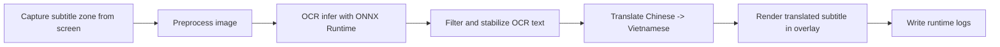
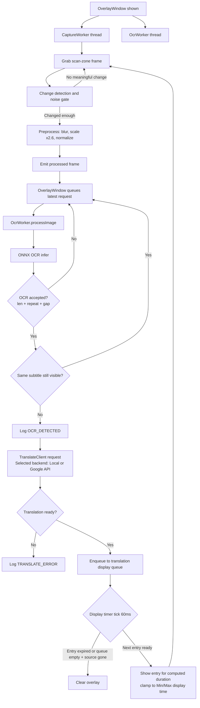

# ScreenSubTranslator

ScreenSubTranslator is a Qt6 desktop overlay tool that captures subtitle area on screen, runs local Chinese OCR with Paddle-style ONNX model in C++, translates text to Vietnamese, and renders translation over the video.

## Architecture

- Qt6 overlay window (transparent, always-on-top, draggable, resizable)
- Capture worker in dedicated thread
- OCR worker in dedicated thread
- OCR engine: ONNX Runtime C++ API (no Python, no Tesseract)
- Translation client: switchable backend (local Llama/Ollama model or Google Translate API)
- Runtime subtitle logs: `subtitle_log.txt`

### End-to-End Pipeline (Capture -> OCR -> Translate -> Render)



Pipeline notes:

- Image preprocessing now includes text-region crop + aspect-ratio-preserving resize + padding to OCR input size.
- OCR text is accepted only when debounce/stability gates pass (minimum length, repeat count, time gap).
- Noise profile parameters (`Fast`, `Balanced`, `Clean`) are centralized in `src/tuning_params.h`.
- Subtitle dedupe gate suppresses repeated dispatch while the same subtitle is still on screen.
- Translation is async and stale/error events are logged to keep overlay responsive.
- Translations are buffered in a **display queue** and shown sequentially with per-entry timing. Stale or overflowing entries are dropped automatically.

## Features

- Red scan frame with drag/resize from edges and corners
- Translation bubble auto-resizes and stays inside frame
- Translation placement selectable above or below source subtitle
- Adaptive capture loop for low latency
- Noise filtering (frame diff ratio + contrast gate)
- OCR debounce and stabilization filters
- Right-click profile menu: Fast, Balanced, Clean
- Hotkeys:
  - `Alt+1`: Fast
  - `Alt+2`: Balanced
  - `Alt+3`: Clean
  - `Alt+T`: toggle translation position
- Default startup profile: `Balanced`

## Requirements

- Ubuntu Linux
- CMake 3.16+
- C++17 compiler
- Qt6 Widgets + Concurrent + Network
- OpenCV 4.x
- ONNX Runtime C++ (required)
- NVIDIA driver + CUDA + cuDNN (required for GPU OCR)

## Install System Dependencies

```bash
sudo apt update
sudo apt install -y build-essential cmake git wget tar
sudo apt install -y qt6-base-dev
sudo apt install -y libopencv-dev
```

## Install NVIDIA Driver + CUDA + cuDNN (RTX4060)

1. Verify GPU:

```bash
nvidia-smi
```

1. Install NVIDIA driver (if missing):

```bash
sudo ubuntu-drivers autoinstall
sudo reboot
```

1. Install CUDA Toolkit (example for Ubuntu official repo flow):

```bash
sudo apt install -y nvidia-cuda-toolkit
```

1. Install cuDNN package compatible with your CUDA version.

Note: exact package name depends on your CUDA version and repo configuration. After install, verify libraries exist:

```bash
ls /usr/lib/x86_64-linux-gnu/libcudnn* || true
```

## Install ONNX Runtime C++ (GPU build)

1. Download ONNX Runtime Linux x64 GPU package from official releases.
1. Extract it, for example to `/opt/onnxruntime-linux-x64-gpu`.

Example:

```bash
cd /tmp
# Replace URL with the exact version you want.
wget https://github.com/microsoft/onnxruntime/releases/download/v1.18.1/onnxruntime-linux-x64-gpu-1.18.1.tgz
tar -xzf onnxruntime-linux-x64-gpu-1.18.1.tgz
sudo mv onnxruntime-linux-x64-gpu-1.18.1 /opt/onnxruntime-linux-x64-gpu
```

1. Export runtime library path:

```bash
export LD_LIBRARY_PATH=/opt/onnxruntime-linux-x64-gpu/lib:$LD_LIBRARY_PATH
```

To persist it:

```bash
echo 'export LD_LIBRARY_PATH=/opt/onnxruntime-linux-x64-gpu/lib:$LD_LIBRARY_PATH' >> ~/.zshrc
source ~/.zshrc
```

## Prepare Paddle OCR ONNX Models

Put model files in:

```text
models/paddle/
├── ch_PP-OCRv4_rec_infer.onnx
└── ppocr_keys_v1.txt
```

Current engine uses recognizer model + charset file. Paths are configured in `src/tuning_params.h`.

## Prepare Local llama.cpp Translation Backend (zh -> vi)

Run `llama-server` with your GGUF Qwen model.

```bash
# Example path, change to your actual model file.
~/llama.cpp/build/bin/llama-server \
  -m /path/to/Qwen2.5-7B-Instruct-Q4_K_M.gguf \
  --host 127.0.0.1 --port 8080 \
  -ngl 99
```

Quick endpoint check (`llama.cpp` native completion API):

```bash
curl http://127.0.0.1:8080/health
```

Optional runtime overrides:

```bash
export SST_LLAMA_BASE_URL=http://127.0.0.1:8080
export SST_LLAMA_MODEL=qwen2.5:7b-instruct-q4_K_M
export SST_LLM_API=llamacpp   # auto | llamacpp | openai | ollama
```

Current defaults in `src/tuning_params.h` target llama.cpp server.

Local translation guardrails:

- The llama.cpp request avoids single-newline stop tokens to reduce empty first-token outputs.
- Retry passes are enabled by default (`kEnableRetryPasses = true`) to rescue empty or suspicious drafts.
- When a local output becomes empty after sanitization, runtime log now includes source/raw snippets for faster diagnosis.
- Trailing punctuation artifacts from model output (for example `。 ：`) are trimmed before display/logging.

## Translation Backend Switch

You can switch translation backend at runtime from right-click menu:
You can switch translation backend at runtime from right-click menu:

- `Translation Backend -> Local Llama (Qwen2.5 7B)`
- `Translation Backend -> Google Translate API`

You can also choose startup backend by env var:

```bash
export SST_TRANSLATE_BACKEND=google   # or local
```

If you keep `local` backend (default), the app calls the local LLM endpoint configured by `SST_LLAMA_BASE_URL`, `SST_LLAMA_MODEL`, and `SST_LLM_API`.

## Glossary For Proper Names (Han-Viet)

To make person/place names more stable (for example `Guangxi -> Quảng Tây`, `Chongqing -> Trùng Khánh`, `田汉 -> Điền Hán`), use `translate/glossary.json` with canonical targets and aliases.

Supported formats:

```json
{
  "glossary": {
    "田汉": {
      "target": "Điền Hán",
      "aliases": ["Tian Han", "Tan Han", "Tán Han"]
    },
    "广西": {
      "target": "Quảng Tây",
      "aliases": ["Guangxi"]
    },
    "重庆": "Trùng Khánh"
  },
  "aliases": {
    "Chongqing": "Trùng Khánh"
  }
}
```

Behavior:

- `glossary` entries are injected into the LLM prompt as term hints.
- Alias rules are also applied after model output sanitization, so Latin/Pinyin variants in generated text are normalized before display.
- You do not need to add every word. Focus on recurring proper nouns (people, places, military titles, organizations).

## Translation Display Queue

Translated subtitles are buffered in an internal queue and rendered sequentially to keep display timing close to the original source subtitle appearance.

### How it works

1. Each completed translation is **enqueued** with an arrival timestamp.
2. A `QTimer` fires every `kDisplayTickMs` ms and calls `tickDisplayQueue()`.
3. Each entry is shown for a duration computed as:

$$\text{duration} = \text{clamp}\!\left(\text{kDisplayBaseMs} + \text{charCount} \times \text{kDisplayMsPerChar},\ \text{kDisplayMinMs},\ \text{kDisplayMaxMs}\right)$$

4. When an entry has been in the queue longer than `kDisplayMaxLatencyMs`, it is **dropped** to avoid showing stale translations.
5. If the queue overflows (`≥ kDisplayQueueMaxSize`), it is **cleared entirely** so that the latest translation is shown immediately.
6. When both the queue is empty and the source Chinese subtitle has disappeared, the overlay is **cleared**.

### Config parameters (`src/tuning_params.h`)

| Parameter | Default | Description |
| --- | --- | --- |
| `kDisplayMinMs` | 600 ms | Minimum display duration per entry |
| `kDisplayMaxMs` | 4000 ms | Maximum display duration per entry |
| `kDisplayBaseMs` | 300 ms | Base duration before per-character contribution |
| `kDisplayMsPerChar` | 75 ms | Added ms per displayed character |
| `kDisplayMaxLatencyMs` | 2500 ms | Drop entry if queued longer than this |
| `kDisplayQueueMaxSize` | 5 | Max queue depth before overflow flush |
| `kDisplayTickMs` | 60 ms | Display timer interval |

## Configure Model Paths

Edit `src/tuning_params.h`:

- `kPaddleRecOnnxPath`
- `kPaddleCharsetPath`
- `kUseCudaExecutionProvider`

Default values are relative to executable folder.

## Build

```bash
mkdir -p build
cd build
cmake .. \
  -DONNXRUNTIME_INCLUDE_DIR=/opt/onnxruntime-linux-x64-gpu/include \
  -DONNXRUNTIME_LIBRARY=/opt/onnxruntime-linux-x64-gpu/lib/libonnxruntime.so
cmake --build . -j"$(nproc)"
```

## Run

```bash
cd build
./ScreenSubTranslator
```

## Validate CUDA OCR Runtime

When GPU provider is correctly available, ONNX Runtime will use CUDA EP when `kUseCudaExecutionProvider = true`.

Quick sanity checks:

```bash
nvidia-smi
ldd ./ScreenSubTranslator | grep onnxruntime
```

If CUDA provider is unavailable, app falls back to CPU and prints a warning.

## OCR Batch Evaluation

```bash
cd build
./OcrBatchEval
```

Evaluator reads:

- labels: `../image/image_sub.txt`
- images: all `imageX` entries found in label file (for example `image1.png` ... `image6.png`)
- debug outputs: `../image/debug_preprocessed/imageX_prepared.png`

### Labeled Sample Evaluation (2026-06-24)

Dataset source:

- labels: `image/image_sub.txt`
- samples: all labeled images in `image/image_sub.txt` (`image1.png` ... `image8.png` at the time of this run)

Exact-match OCR result (after whitespace normalization):

| Image | Ground truth | OCR output | Match |
| --- | --- | --- | --- |
| image1 | 老师老师 | 老师老师 | YES |
| image2 | 同志们当这个城市在进行着 | 同志们当这个城市在进行着 | YES |
| image3 | 有秩序的撤退的时候 | 有秩序的撤退的时候 | YES |
| image4 | 是你们依然坚持在这里 | 是你们依然坚持在这里 | YES |
| image5 | 当这个城市 | 当这个城市 | YES |
| image6 | 日军企图不费大力 | 日军企图不费大力 | YES |
| image7 | 四个多月的时间 | 四个多月的时间 | YES |
| image8 | 和数万士兵的生命换来的 | 和数万士兵的生命换来的 | YES |
| image9 | 这样做是否会引起民怨 | 这样做是否会引起民怨 | YES |
| image10 | 好的另外我还想问一下 | 好的另外我还想问一下 | YES |

Summary:

- Exact match: **10/10**
- Exact-match accuracy: **100.00%**
- Result command: `cd build && ./OcrBatchEval`

### Current Tool Flow



Batch evaluator flow (`OcrBatchEval`): load Chinese labels -> read each labeled image -> preprocess -> OCR -> normalize/compare -> run local zh->vi translation -> print per-image OCR and translation output -> print summary and write translation report.

Translation evaluation outputs:

- report file: `image/translation_eval.txt`
- optional Vietnamese labels file for exact-match scoring: `image/image_sub_vi.txt`

When `image/image_sub_vi.txt` exists (format identical to `image/image_sub.txt`), evaluator also prints:

- `VI exact match (from OCR)`
- `VI exact match (from GT)`

## File Responsibilities

| File | Responsibility |
| --- | --- |
| `main.cpp` | Create `QApplication`, start `OverlayWindow`, run app loop |
| `src/overlay_window.h/.cpp` | UI overlay, drag/resize scan frame, worker thread wiring, OCR acceptance gate, translation display/logging |
| `src/capture_worker.h/.cpp` | Grab screen region, detect meaningful frame change, preprocess grayscale frame before OCR |
| `src/ocr_worker.h/.cpp` | Worker-thread bridge: receive preprocessed frame, call OCR engine, emit result/error |
| `src/ocr_engine.h/.cpp` | ONNX Runtime session, Paddle charset loading, OCR infer, text normalization |
| `src/translate_client.h/.cpp` | Async Chinese->Vietnamese translation with runtime switch between local ONNX and Google API |
| `src/tuning_params.h` | Central tuning constants (model paths, OCR input size, per-profile thresholds, debounce values, subtitle dedupe timing, translation display queue parameters) |
| `tools/ocr_batch_eval.cpp` | Offline evaluator for labeled samples in `image/`, prints per-image match and summary |
| `image/image_sub.txt` | Ground-truth subtitle labels for batch OCR evaluation |
| `image/debug_preprocessed/` | Saved preprocessed images for debugging OCR input quality |

## Logging

Runtime logs are written to:

- `build/subtitle_log.txt`

Log event types:

| Event | Description |
| --- | --- |
| `SESSION_START` | Application started |
| `PROFILE_CHANGED` | Noise profile switched |
| `OCR_CAP-->` | Raw OCR frame captured |
| `OCR_REJECTED` | OCR result rejected (insufficient Han chars) |
| `OCR_ROLLBACK` | Candidate rolled back to previous best |
| `OCR_DETECTED` | OCR text accepted and dispatched for translation |
| `TRANSLATED` | Translation received from backend |
| `TRANSLATED_STALE` | Translation arrived for a source that is no longer current |
| `TRANSLATE_ERROR` | Translation backend error |
| `DISPLAY_ENQUEUED` | Translation added to display queue |
| `DISPLAY_SHOW` | Translation dequeued and shown on overlay |
| `DISPLAY_DROPPED_STALE` | Entry removed from queue (exceeded max latency) |
| `DISPLAY_QUEUE_OVERFLOW` | Queue was full; cleared to prioritize latest entry |
| `DISPLAY_CLEARED` | Overlay cleared after source subtitle disappeared and queue is empty |

## Project Structure

```text
screen_sub_translate/
├── CMakeLists.txt
├── main.cpp
├── README.md
├── models/
│   ├── paddle/
│   └── translate/
└── src/
    ├── capture_worker.h
    ├── capture_worker.cpp
    ├── ocr_engine.h
    ├── ocr_engine.cpp
    ├── ocr_worker.h
    ├── ocr_worker.cpp
    ├── overlay_window.h
    ├── overlay_window.cpp
    ├── translate_client.h
    ├── translate_client.cpp
    └── tuning_params.h
```
