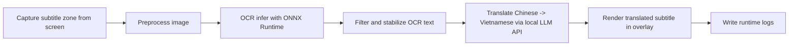
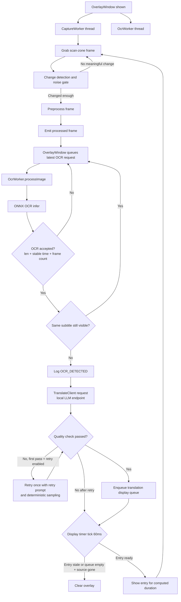

# ScreenSubTranslator

ScreenSubTranslator is a Qt6 desktop overlay tool that captures an on-screen subtitle zone, runs local Chinese OCR with Paddle-style ONNX models in C++, translates to Vietnamese using a local LLM endpoint (llama.cpp/Ollama/OpenAI-compatible local API), and renders the translation over video in near real time.

## Demo (Placeholder - Add Media Later)

Use this section as the fixed place to add your demo assets.

### Screenshot

<!-- Replace with your real screenshot path -->


### Video

<!-- Replace with your real video URL or local file link -->
[Demo Video Placeholder](https://example.com/replace-with-your-demo-video)

## Architecture

- Qt6 transparent overlay window (always-on-top, draggable, resizable)
- Capture worker in a dedicated thread
- OCR worker in a dedicated thread
- OCR subtitle filter module extracted in `src/ocr_subtitle_filter.h/.cpp`
- Subtitle logger in a dedicated thread
- OCR engine: ONNX Runtime C++ API (no Python, no Tesseract)
- Translation client: local LLM HTTP API only
- Runtime subtitle logs: `test/subtitles/chinese.srt`, `test/subtitles/vietnamese.srt`
- Debug runtime event log: `test/subtitle_log.txt` (Debug build only)

### End-to-End Pipeline (Capture -> OCR -> Translate -> Render)



Pipeline notes:

- Image preprocessing includes text-region crop + aspect-ratio-preserving resize + padding to OCR input size.
- OCR text is accepted only when debounce/stability gates pass (length, stable time, seen frames).
- OCR noise-gate parameters are centralized in `src/tuning_params.h` (single fixed configuration, currently aligned with the previous Balanced tuning).
- Subtitle dedupe gate suppresses repeated dispatch while the same subtitle is still on screen.
- Translation is async; stale/error events are handled without freezing the overlay.
- Translation prompts are built per accepted OCR line. By default, the app does not inject `movie_context.txt` into the per-line prompt to avoid broad context leaking into model output; it still includes recent Chinese dialogue context and only the glossary entries that match the current source line.
- Translation output goes through candidate selection, sanitization, quality checks, post-processing, glossary alias normalization, and a final quality check before being emitted.
- If the first pass fails and retry is enabled, the app performs one retry using a retry-specific prompt with the detected quality issue and stricter sampling parameters.
- Translations are buffered in a display queue and shown sequentially with per-entry timing.

Translation retry policy:

- The first pass uses `translationPrompt()` and normal generation parameters.
- The prompt contains strict output rules, matching glossary entries for the current source line, recent Chinese dialogue context, and the current source line. `movie_context.txt` is intentionally not injected into the first-pass prompt by default because broad user-provided context can be repeated or paraphrased by small local models.
- The raw model output is reduced to the best Vietnamese candidate, sanitized, then checked by `evaluateTranslationQuality()`.
- If the first pass fails and `kEnableRetryPasses` is enabled, the app retries once with `translationRetryPrompt()`. The retry prompt includes the quality issue hint, the same matching glossary block, recent Chinese dialogue context, the source line, and the previous raw translation.
- Retry parameters are fixed in `src/tuning_params.h`: `temperature = 0.02`, `top_k = 30`, `top_p = 0.8`, `min_p = 0.1`.
- If retry also fails, the result is rejected and logged as `TRANSLATE_ERROR`.

### Runtime Flow



## Build and Installation

### Requirements

- Linux desktop environment (tested on Ubuntu)
- CMake 3.16+
- C++17 compiler
- Qt6 Widgets + Concurrent + Network
- OpenCV 4.x
- ONNX Runtime C++
- SentencePiece C++ library (`libsentencepiece-dev`)
- NVIDIA driver + CUDA + cuDNN (required only if you enable CUDA OCR provider)

### Install System Dependencies (Ubuntu)

```bash
sudo apt update
sudo apt install -y build-essential cmake git wget tar
sudo apt install -y qt6-base-dev libopencv-dev libsentencepiece-dev
```

### Install ONNX Runtime C++

1. Download ONNX Runtime Linux package (CPU or GPU) from official releases.
2. Extract to a fixed directory, for example `/opt/onnxruntime-linux-x64-gpu`.
3. Export root path for CMake discovery:

```bash
export ONNXRUNTIME_ROOT=/opt/onnxruntime-linux-x64-gpu
```

(Optional) persist in shell profile:

```bash
echo 'export ONNXRUNTIME_ROOT=/opt/onnxruntime-linux-x64-gpu' >> ~/.zshrc
source ~/.zshrc
```

If you use GPU package, also export runtime library path:

```bash
export LD_LIBRARY_PATH=/opt/onnxruntime-linux-x64-gpu/lib:$LD_LIBRARY_PATH
```

### Prepare OCR Model Files

The `models/` directory is intentionally gitignored, so model files are not included in this repository.
You must download and place PaddleOCR model assets manually before running the app.

Place OCR model assets at:

```text
models/paddle/
├── ch_PP-OCRv4_rec_infer.onnx
└── ppocr_keys_v1.txt
```

Create the directory:

```bash
mkdir -p models/paddle
```

Download model files:

1. Download PaddleOCR recognition ONNX model (`ch_PP-OCRv4_rec_infer.onnx`).
2. Download matching character dictionary (`ppocr_keys_v1.txt`).

You can obtain both files from PaddleOCR official release resources or trusted mirrors, then copy them into `models/paddle/`.

Quick verification:

```bash
ls -lh models/paddle/ch_PP-OCRv4_rec_infer.onnx models/paddle/ppocr_keys_v1.txt
```

Default paths are configured in `src/tuning_params.h`.

### Build

> **Prerequisite:** `ONNXRUNTIME_ROOT` must be set to your ONNX Runtime install path before running CMake (see [Install ONNX Runtime C++](#install-onnx-runtime-c) above). If you followed that section and persisted the export in `~/.zshrc`, it is already available. Otherwise set it now:
>
> ```bash
> export ONNXRUNTIME_ROOT=/opt/onnxruntime-linux-x64-gpu
> ```

By default, CMake sets `Release` if `CMAKE_BUILD_TYPE` is not specified.

**Release build** (default, for normal use):

```bash
mkdir -p build
cd build
cmake .. -DCMAKE_BUILD_TYPE=Release
cmake --build . -j"$(nproc)"
```

**Debug build** (enables runtime event log and CaptureWorker debug images):

```bash
mkdir -p build-debug
cd build-debug
cmake .. -DCMAKE_BUILD_TYPE=Debug
cmake --build . -j"$(nproc)"
```

Useful CMake options:

| Option | Default | Description |
| --- | --- | --- |
| `CMAKE_BUILD_TYPE` | `Release` | Build mode (`Debug` or `Release`) |
| `ONNXRUNTIME_ROOT` (env) | empty | **Required** if ONNX Runtime is not in a standard system path (e.g. `/opt/onnxruntime-linux-x64-gpu`) |

Notes:

- `test/subtitles/chinese.srt` and `test/subtitles/vietnamese.srt` are generated in every build type.
- `test/subtitle_log.txt` and CaptureWorker debug preprocessed images are enabled automatically when building with `-DCMAKE_BUILD_TYPE=Debug`.

### Run

```bash
cd build
./ScreenSubTranslator
```

## Configuration

### Translation Backend Setup

The app uses local translation backend only. Choose one of the following options:

#### Option A: llama.cpp server

```bash
~/llama.cpp/build/bin/llama-server \
  -m /path/to/Qwen2.5-7B-Instruct-Q4_K_M.gguf \
  --host 127.0.0.1 --port 8080 \
  -ngl 99
```

Health check:

```bash
curl http://127.0.0.1:8080/health
```

#### Option B: Ollama

Run Ollama separately (default port `11434`), then configure API mode/base URL in `translate/translation_backend.json`.

#### Option C: OpenAI-compatible local endpoint

Use any local server exposing `/v1/chat/completions`.

### Backend Runtime Config

The app loads translation backend settings from:

- `translate/translation_backend.json`

Default file content:

```json
{
  "apiMode": "auto",
  "baseUrl": "http://127.0.0.1:8080",
  "model": "",
  "autoDiscoverModel": true,
  "modelDiscoveryTimeoutMs": 1200,
  "cachePrompt": true,
  "repeatPenalty": 1.1,
  "frequencyPenalty": 1.05,
  "repeatLastN": 64,
  "contextFile": "../translate/movie_context.txt",
  "glossaryFile": "../translate/glossary.json"
}
```

Fields:

- `apiMode`: `auto | llamacpp | openai | ollama`
- `baseUrl`: backend base URL
- `model`: optional model name. Keep empty to avoid hard-coding model in app.
- `autoDiscoverModel`: when `true`, app tries to discover model from endpoint for Ollama/OpenAI-compatible APIs.
- `modelDiscoveryTimeoutMs`: timeout for model discovery request.
- `cachePrompt`: llama.cpp `cache_prompt` option.
- `repeatPenalty`: llama.cpp `repeat_penalty` option.
- `frequencyPenalty`: llama.cpp `frequency_penalty` option.
- `repeatLastN`: llama.cpp `repeat_last_n` option.
- `temperature`: first-pass sampling temperature (default `0.01`). Overrides the code default.
- `numPredict`: max new tokens per response (default `64`). Overrides the code default.
- `retryTemperature`: temperature for the single retry pass (default `0.3`, looser than first pass). Overrides the code default.
- `contextFile`: optional movie context file path. The file is still loaded for compatibility, but the current default runtime translation prompt does not inject it into per-line requests to reduce context leakage.
- `glossaryFile`: glossary JSON path

Notes:

- First-pass generation knobs `temperature` and `numPredict` are now runtime-overridable via `translation_backend.json`; the values in `src/tuning_params.h` (`kTranslateTemperature`, `kTranslateNumPredict`) are only the code defaults used when the JSON omits them.
- Runtime JSON options such as `repeatPenalty`, `frequencyPenalty`, and `repeatLastN` are intended for backend/runtime tuning without rebuilding the app.
- Retry generation temperature is now `retryTemperature` in `translation_backend.json` (default `0.3`); the remaining retry knobs stay fixed in `src/tuning_params.h`: `top_k = 30`, `top_p = 0.8`, `min_p = 0.1`.

Examples:

llama.cpp (`/completion` API):

```json
{
  "apiMode": "llamacpp",
  "baseUrl": "http://127.0.0.1:8080",
  "model": "",
  "autoDiscoverModel": false,
  "modelDiscoveryTimeoutMs": 1200,
  "cachePrompt": true,
  "repeatPenalty": 1.1,
  "frequencyPenalty": 1.05,
  "repeatLastN": 64,
  "contextFile": "../translate/movie_context.txt",
  "glossaryFile": "../translate/glossary.json"
}
```

Ollama:

```json
{
  "apiMode": "ollama",
  "baseUrl": "http://127.0.0.1:11434",
  "model": "",
  "autoDiscoverModel": true,
  "modelDiscoveryTimeoutMs": 1200,
  "contextFile": "../translate/movie_context.txt",
  "glossaryFile": "../translate/glossary.json"
}
```

OpenAI-compatible local API:

```json
{
  "apiMode": "openai",
  "baseUrl": "http://127.0.0.1:8000/v1",
  "model": "",
  "autoDiscoverModel": true,
  "modelDiscoveryTimeoutMs": 1200,
  "contextFile": "../translate/movie_context.txt",
  "glossaryFile": "../translate/glossary.json"
}
```

`apiMode=auto` resolution behavior:

- Base URL contains `:11434` or `/api` -> treat as Ollama API
- Base URL contains `/v1` -> treat as OpenAI-compatible API
- Otherwise -> treat as llama.cpp completion API

### Glossary For Proper Names

To stabilize person/place names (for example `Guangxi -> Quảng Tây`, `Chongqing -> Trùng Khánh`, `田汉 -> Điền Hán`), use `translate/glossary.json`.

Supported format:

```json
{
  "glossary": {
    "田汉": "Điền Hán",
    "广西": "Quảng Tây",
    "重庆": "Trùng Khánh",
    "破坏": "phá hoại"
  },
  "aliases": {
    "Tian Han": "Điền Hán",
    "Tan Han": "Điền Hán",
    "Guangxi": "Quảng Tây",
    "Chongqing": "Trùng Khánh"
  }
}
```

Behavior:

- `glossary` is used at prompt time. For each source subtitle line, the app selects only glossary entries whose source term appears in that line.
- The app does not inject the full `glossary.json` into every prompt. The per-line glossary block is limited to 8 entries and 360 characters.
- Glossary keys should match the script used by the film/OCR source. For simplified Chinese films, keep glossary keys in simplified Chinese.
- `aliases` are not injected into the prompt. They are applied after translation post-processing to normalize final Vietnamese output, especially when the model emits romanized or English-style names.
- Longer glossary terms and aliases are prioritized first to reduce partial replacement issues.

Prompt insertion example:

```text
Glossary for this line. Use these exact Vietnamese terms when they appear in the source:
重庆 = Trùng Khánh
破坏 = phá hoại
```

The first-pass prompt order is:

1. Translation rules.
2. Matching glossary entries for the current source line.
3. Recent Chinese dialogue context only, not previous Vietnamese translations.
4. The current source line and `Vietnamese subtitle:` marker.

`translate/movie_context.txt` is not injected into the first-pass prompt by default. This avoids cases where small local LLMs repeat or translate broad movie context into the subtitle output, especially when the OCR source line is short or noisy.

The retry prompt also includes the matching glossary block when available.

### Translation Quality Controls

Implemented across translation modules:

- **Pre-translation validation** (`translation_text_processor.cpp`):
  - Reject obvious non-Chinese OCR candidates before sending a translation request.
  - This prevents OCR noise, UI text, or non-subtitle regions from consuming backend requests.

- **Main translation flow** (`translate_client.cpp`):
  - The normal path is:
    `translationPrompt -> raw model output -> selectBestVietnameseLine -> sanitizeFinalTranslation -> evaluateTranslationQuality`.
  - If the candidate passes the first quality check, the app applies:
    `removeHanCharacters -> postProcessTranslation -> alias normalization -> final quality check`.
  - If the final result passes, it is emitted and the Chinese source plus Vietnamese translation are stored in recent dialogue context.
  - Recent dialogue context sent back into prompts contains only previous Chinese source lines, not previous Vietnamese translations, to avoid feedback loops from bad model output.

- **Text sanitization** (`translation_text_processor.cpp`):
  - `selectBestVietnameseLine()` splits raw model output into candidates and scores likely Vietnamese lines while penalizing Han characters.
  - `sanitizeFinalTranslation()` removes common model-output wrappers such as labels, quotes, chained alternatives, CJK punctuation noise, and spacing artifacts.
  - `removeHanCharacters()` removes remaining Han characters only after a candidate has passed or when retry fallback allows residual Han removal.
  - `postProcessTranslation()` normalizes punctuation and whitespace before alias normalization.

- **Centralized quality checks** (`translation_text_processor.cpp`):
  - Quality evaluation is centralized in `evaluateTranslationQuality()`, which returns a `TranslationIssue`.
  - Current issue types include `None`, `Empty`, `NoUsableVietnameseCandidate`, `ContainsHan`, `ResidualHan`, `EnglishHeavy`, `OverExpanded`, `TooShort`, `TooLong`, `Repeated`, `UnexpectedEnglish`, and `LowScore`.

- **Single retry orchestration** (`translate_client.cpp`):
  - If the first quality check fails and `kEnableRetryPasses` is enabled, the client performs exactly one retry using `translationRetryPrompt()`.
  - The retry prompt contains an issue-specific instruction generated from the detected `TranslationIssue`, the same matching glossary block, recent Chinese dialogue context, the source line, and the previous raw translation.

- **Retry decoding parameters** (`translate_client.cpp`):
  - Retry requests use fixed conservative sampling parameters:
    `temperature = 0.02`, `top_k = 30`, `top_p = 0.8`, `min_p = 0.1`.
  - If the retry result still fails quality checks, the client emits `translationError()` with the corresponding quality issue message.

- **Glossary normalization** (`translation_text_processor.cpp`):
  - Alias rules from the `aliases` section of `translate/glossary.json` are applied after sanitization and post-processing to stabilize proper names in final Vietnamese output.
  - Alias rules are output-side normalization only; they are not inserted into the LLM prompt.
  - Longer aliases are prioritized first to reduce partial replacement issues.

Current default in `src/tuning_params.h`:

- `kEnableRetryPasses = true`

### Translation Display Queue

Translated subtitles are buffered and rendered sequentially to preserve timing quality.

How it works:

1. Each completed translation is enqueued with timestamp.
2. `tickDisplayQueue()` runs every `kDisplayTickMs`.
3. Display duration per entry:

$$
\text{duration} = \text{clamp}\left(\text{kDisplayBaseMs} + \text{charCount} \times \text{kDisplayMsPerChar},\ \text{kDisplayMinMs},\ \text{kDisplayMaxMs}\right)
$$

4. Stale queue entries (`> kDisplayMaxLatencyMs`) are dropped.
5. If queue size reaches `kDisplayQueueMaxSize`, queue is flushed to prioritize newest subtitle.
6. When queue is empty and source subtitle has disappeared, overlay is cleared.

Current defaults (`src/tuning_params.h`):

| Parameter | Default | Description |
| --- | --- | --- |
| `kDisplayMinMs` | 300 ms | Minimum display duration per entry |
| `kDisplayMaxMs` | 3000 ms | Maximum display duration per entry |
| `kDisplayBaseMs` | 250 ms | Base duration before per-character contribution |
| `kDisplayMsPerChar` | 70 ms | Added ms per displayed character |
| `kDisplayMaxLatencyMs` | 2500 ms | Drop entry if queued longer than this |
| `kDisplayQueueMaxSize` | 5 | Max queue depth before overflow flush |
| `kDisplayTickMs` | 60 ms | Display timer interval |

### Tuning Parameters Reference

All tuning constants are centralized in `src/tuning_params.h`. Key parameters:

**Translation Backend**:
- `kTranslateBackendConfigPath`: `"../translate/translation_backend.json"`
- `kTranslateBaseUrl`: `"http://127.0.0.1:8080"`
- `kTranslateApiMode`: `"auto"`
- `kTranslateModel`: `""` (empty for auto-discovery)
- `kTranslateTemperature`: `0.01` (first-pass sampling temperature; JSON default, override with `temperature`)
- `kTranslateNumPredict`: `64` (max tokens; JSON default, override with `numPredict`)

**Translation Context and Retry**:
- `kEnableRetryPasses`: `true`
- `kTranslateRetryTemperature`: `0.3` (JSON default, override with `retryTemperature`; looser than first pass)
- `kTranslateRetryTopK`: `30`
- `kTranslateRetryTopP`: `0.8`
- `kTranslateRetryMinP`: `0.1`
- `kTranslateRequestTimeoutMs`: `15000` (abort a stalled translation request so a frozen backend cannot wedge the pipeline)
- `kTranslationCacheSize`: `96` (LRU cache of successful translations keyed by source line)

**OCR Configuration**:
- `kPaddleRecOnnxPath`: `"../models/paddle/ch_PP-OCRv4_rec_infer.onnx"`
- `kPaddleCharsetPath`: `"../models/paddle/ppocr_keys_v1.txt"`
- `kUseCudaExecutionProvider`: `true` (falls back to CPU with a warning if the CUDA EP is unavailable)

**OCR Acceptance Gates**:
- `kMinOcrLength`: `1`
- `kMinHanCharsForCandidate`: `1`
- `kMinCandidateStableMs`: `150` ms
- Short-text gates: `kShortCandidateStableMs` `150` ms / `kVeryShortCandidateStableMs` `350` ms and `kShortCandidateMinFrames` / `kVeryShortCandidateMinFrames`

**Capture Settings**:
- `kCaptureIntervalMs`: `50` ms
- `kChangeThreshold`: `1.65` (mean frame-diff gate)
- `kMinChangedRatio`: `0.009` (changed-pixel ratio gate)
- `kMinStdDev`: `8.5` (low-contrast frame rejection)

**Translation Context**:
- `kTranslatePromptContextMaxChars`: `900` for loading `movie_context.txt`; the loaded movie context is currently not injected into normal per-line translation prompts by default.
- `kTranslateHistoryWindowSize`: `2`
- Retry uses `translationRetryPrompt()` with the detected quality issue, the previous raw model output, recent Chinese dialogue context, and matching glossary entries for the current source line.

## Daily Usage

### Running the Application

```bash
cd build
./ScreenSubTranslator
```

### Translation Workflows

This section shows the practical flow for translating subtitles while watching a video.

#### Workflow A: Ollama

1. Start Ollama service and ensure your model is available:

```bash
ollama list
# optional quick run check
ollama run qwen2.5:7b "xin chao"
```

2. Update `translate/translation_backend.json` for Ollama:

```json
{
  "apiMode": "ollama",
  "baseUrl": "http://127.0.0.1:11434",
  "model": "qwen2.5:7b",
  "autoDiscoverModel": true,
  "modelDiscoveryTimeoutMs": 1200,
  "cachePrompt": true,
  "repeatPenalty": 1.1,
  "frequencyPenalty": 1.05,
  "repeatLastN": 64,
  "contextFile": "../translate/movie_context.txt",
  "glossaryFile": "../translate/glossary.json"
}
```

3. Run the app:

```bash
cd build
./ScreenSubTranslator
```

4. Place the red scan frame on top of the source subtitle area in your video player.
5. Resize the frame so it tightly covers subtitle text only (avoid logos/UI overlays).
6. Keep video playing; translated Vietnamese lines will appear in the overlay bubble.
7. Use right-click menu or `Alt+T` to switch translation position (above/below subtitle).

#### Workflow B: llama.cpp

1. Start `llama-server` with your preferred GGUF model:

```bash
~/llama.cpp/build/bin/llama-server \
  -m /path/to/your-model.gguf \
  --host 127.0.0.1 --port 8080 \
  -ngl 99
```

2. (Optional) verify server health:

```bash
curl http://127.0.0.1:8080/health
```

3. Update `translate/translation_backend.json` for llama.cpp:

```json
{
  "apiMode": "llamacpp",
  "baseUrl": "http://127.0.0.1:8080",
  "model": "",
  "autoDiscoverModel": false,
  "modelDiscoveryTimeoutMs": 1200,
  "cachePrompt": true,
  "repeatPenalty": 1.1,
  "frequencyPenalty": 1.05,
  "repeatLastN": 64,
  "contextFile": "../translate/movie_context.txt",
  "glossaryFile": "../translate/glossary.json"
}
```

3. Run the app and position the scan frame as in Workflow A.
4. Adjust subtitle position via right-click menu or `Alt+T` when needed.

### Troubleshooting

1. No translation appears:
  - Check backend server is running and reachable at `baseUrl`.
  - Confirm scan frame is over subtitle text, not black bars or player controls.
2. Wrong model is used:
  - Set `model` explicitly in `translate/translation_backend.json`.
3. Proper names are inconsistent:
  - Add entries in `translate/glossary.json` and restart app.
4. Latency feels high:
  - Use a smaller/faster model or GPU acceleration on backend.

## Advanced Topics

### CUDA OCR Runtime (Optional)

When `kUseCudaExecutionProvider = true`, OCR engine attempts CUDA EP first.

Quick checks:

```bash
nvidia-smi
ldd ./ScreenSubTranslator | grep onnxruntime
```

If CUDA EP is unavailable, runtime falls back to CPU with warning logs.

### OCR Batch Evaluation Tool

```bash
cd build
./OcrBatchEval
```

`OcrBatchEval` uses paths relative to the build directory:

- image directory: `../test/image`
- zh labels: `../test/image/image_sub.txt`
- vi labels (optional): `../test/image/image_sub_vi.txt`
- debug preprocessed output: `../test/image/debug_preprocessed`
- translation report: `../test/image/translation_eval.txt`

Important note:

- `OcrBatchEval` currently uses legacy ONNX translator assets from `../models/translate` (`encoder_model.onnx`, `decoder_model.onnx`, `source.spm`, `target.spm`, `vocab.json`).
- This is separate from runtime overlay translation, which now uses local LLM HTTP API.

## Logging

Runtime log files:

- `test/subtitles/chinese.srt`
- `test/subtitles/vietnamese.srt`
- `test/subtitle_log.txt` (Debug build only)

Main log event types:

| Event | Description |
| --- | --- |
| `SESSION_START` | Application started |
| `OCR_DETECTED` | OCR candidate accepted and dispatched to translator |
| `OCR_ROLLBACK` | Candidate fallback to stronger OCR variant |
| `OCR_ERROR` | OCR worker error |
| `TRANSLATED` | Translation received |
| `TRANSLATE_ERROR` | Translation failure/rejection |
| `POSITION_CHANGED` | Translation position changed from menu |
| `POSITION_TOGGLED` | Translation position toggled by hotkey |
| `DISPLAY_DROPPED_STALE` | Queue entry dropped due to max latency |
| `DISPLAY_CLEARED` | Overlay cleared when source gone and queue empty |

The `.srt` files are emitted in both Debug and Release builds. Runtime subtitle logging is handled by a dedicated background logger thread so file I/O does not run on the overlay UI thread.

## Project Structure

### Module Organization

**Translation Subsystem** (3 modules):
- `src/translate_client.h / .cpp` - Translation orchestrator: async HTTP requests, single-retry flow, retry sampling parameters, pending/in-flight state management
- `src/translation_backend_adapter.h / .cpp` - Backend connection: JSON config, API mode resolution, model discovery, HTTP response extraction
- `src/translation_text_processor.h / .cpp` - Text processing: prompt construction, sanitization, post-processing, centralized quality checks, issue messages, glossary normalization

**Core Application**:
- `main.cpp` - Application entry point
- `src/overlay_window.h / .cpp` - Main UI window, scan frame, worker coordination, display queue, hotkeys/menu actions, and subtitle lifecycle handling
- `src/capture_worker.h / .cpp` - Screen capture worker thread, frame-diff gate, contrast/noise checks, and OCR input preprocessing
- `src/ocr_worker.h / .cpp` - OCR worker thread that receives processed frames, calls the OCR engine, and passes recognized text through the subtitle filter
- `src/ocr_engine.h / .cpp` - ONNX Runtime OCR inference engine using Paddle-style recognition model and character dictionary
- `src/ocr_subtitle_filter.h / .cpp` - OCR subtitle stabilization and dedupe filter before translation dispatch
- `src/subtitle_logger.h / .cpp` - SRT file writer worker thread for Chinese source and Vietnamese translation logs
- `src/tuning_params.h` - Centralized tuning constants for capture, OCR gates, translation, retry, and display timing

**OCR Subtitle Filter** (`src/ocr_subtitle_filter.h / .cpp`):
- The filter is responsible for converting noisy per-frame OCR results into a stable subtitle candidate. It rejects empty/non-Chinese candidates, requires a minimum Han-character count, and waits for configurable stable time plus seen-frame thresholds before allowing dispatch.
- Candidate tracking uses frequency voting and a quality score based on Han-character count and text length. This helps recover the strongest OCR variant when consecutive frames contain partial reads or small recognition differences.
- Similarity checks combine containment, Levenshtein distance, longest common substring, and longest common subsequence. These checks decide whether a new OCR read belongs to the current subtitle or should start a fresh candidate window.
- Dispatch dedupe is handled with normalized subtitle keys containing only Han characters and ASCII digits. Recently dispatched keys are kept in a bounded queue so the same subtitle is not resent while it is still visible on screen.
- Short subtitles are treated more conservatively by requiring longer stability and more seen frames. When the subtitle disappears, the filter resets candidate state and clears recent visible-subtitle keys.

**Tools**:
- `tools/ocr_batch_eval.cpp` - Batch OCR evaluation tool

**Configuration**:
- `translate/translation_backend.json` - Runtime backend config
- `translate/glossary.json` - Proper name glossary
- `translate/movie_context.txt` - Optional movie context file. It is loaded for compatibility, but current per-line translation prompts do not inject it by default to avoid context leakage in local LLM output.

### Full Directory Tree

```text
screen_sub_translate/
├── CMakeLists.txt
├── main.cpp
├── README.md
├── build/                                  # Local build output (gitignored)
│   ├── CMakeCache.txt
│   └── ScreenSubTranslator                 # Main executable after build
├── src/                                    # Source files
│   ├── capture_worker.h / .cpp             # Screen capture worker
│   ├── ocr_engine.h / .cpp                 # ONNX OCR inference
│   ├── ocr_subtitle_filter.h / .cpp        # OCR stabilization, rollback, and dedupe filter
│   ├── ocr_worker.h / .cpp                 # OCR worker thread
│   ├── overlay_window.h / .cpp             # Main UI window
│   ├── subtitle_logger.h / .cpp            # SRT logger thread
│   ├── translate_client.h / .cpp           # Translation orchestrator
│   ├── translation_backend_adapter.h / .cpp # Backend HTTP/config handler
│   ├── translation_text_processor.h / .cpp # Text processing/validation
│   └── tuning_params.h                     # Tuning constants
├── test/                                   # Runtime logs and test data
│   ├── image/                              # OCR/translation evaluation images and labels
│   │   ├── image_sub.txt                   # Chinese image labels
│   │   ├── image_sub_vi.txt                # Vietnamese image labels
│   │   ├── translation_eval.txt            # Batch translation/evaluation report
│   │   └── debug_preprocessed/             # Debug preprocessed image output
│   ├── subtitles/
│   │   ├── chinese.srt                     # Source subtitle log
│   │   └── vietnamese.srt                  # Translation log
│   ├── subtitle_log.txt                    # Debug runtime event log
│   ├── terminal_log.txt                    # Terminal/debug notes
│   └── video_test_sub.txt                  # Video test subtitle data
├── tools/
│   └── ocr_batch_eval.cpp                  # Batch OCR evaluator
├── translate/                              # Translation config/data
│   ├── translation_backend.json            # Backend runtime config
│   ├── glossary.json                       # Proper name glossary
│   └── movie_context.txt                   # Optional prompt context
└── models/paddle/                          # OCR model files (gitignored, must be added manually)
    ├── ch_PP-OCRv4_rec_infer.onnx          # PaddleOCR model
    └── ppocr_keys_v1.txt                   # Character dictionary
```
