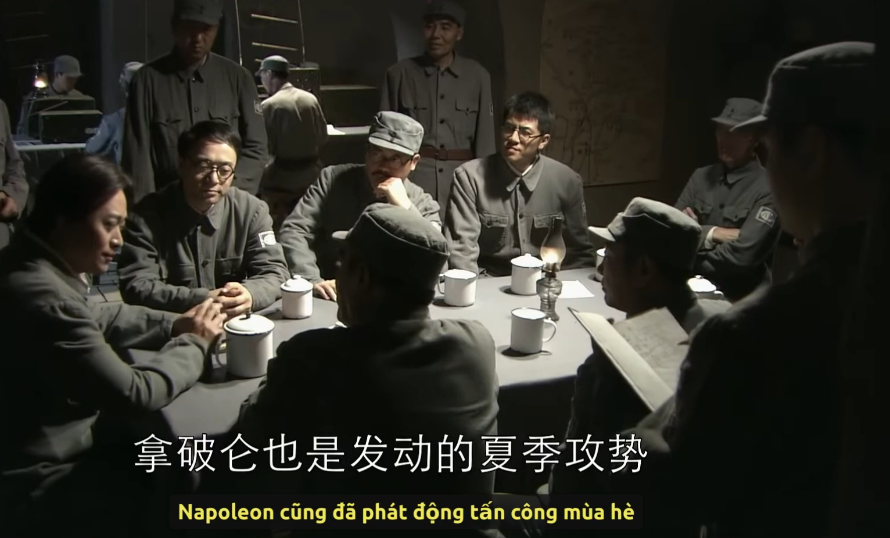
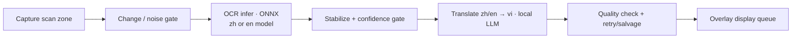

# ScreenSubTranslator

A Qt6 desktop overlay that translates **on-screen Chinese or English subtitles into Vietnamese in near real time** — fully local. It captures a screen region, runs OCR (PaddleOCR ONNX, C++), sends each line to a local LLM (llama.cpp / Ollama / any OpenAI-compatible endpoint), and draws the Vietnamese text back over the video.

Each source language runs its **own pipeline**: a dedicated recognition model and charset, its own OCR text normalization and stabilization rules, and its own prompt, glossary and translation quality gate. Switch between them from the capture window's right-click menu — no restart.

> Personal hobby project — built to watch films that have no Vietnamese subtitles. Not a commercial product. Priorities are **low latency and smooth playback**, so it deliberately trades some translation polish for speed and simplicity.

## Demo

https://github.com/user-attachments/assets/214c5682-b3bf-4e6d-ba5b-7ff9da1f5a35
> Live Chinese → Vietnamese translation over an unsubtitled film

### Screenshots



## How it works



- **Capture** runs on its own thread and only forwards frames that changed enough (frame-diff + contrast gates), so a static screen costs almost nothing.
- **OCR** runs on its own thread, using the recognition model of the selected source language. Leading/trailing characters with low per-character confidence are trimmed (`edgeMinConfidence`): dark margins or background that slip into the crop otherwise decode as a stray edge character (typically 嶺 for Chinese) that would leak into the translation. A read is then accepted only after it is stable across a few frames and passes a **per-character confidence gate** (`minOcrConfidence`), which drops garbled reads before they reach the model.
  - Post-decode cleanup differs per language: the Chinese path strips **all** whitespace (Han has no word spacing, so any space is OCR noise), while the English path **preserves** single spaces — word boundaries carry meaning and everything downstream depends on them.
- **Stabilization/dedupe** (`ocr_subtitle_filter`) turns noisy per-frame reads into one candidate and avoids re-translating a subtitle that is still on screen. Text length is measured in *source units* — Han characters for Chinese, words for English — so the same thresholds mean the same thing in both.
- **Translation** is async. Each accepted line is turned into a strict prompt (rules + matching glossary + recent source lines). Output goes through candidate selection → sanitize → quality check.
  - The prompts are **not** a shared template: the Chinese one asks for Sino-Vietnamese readings of proper names, the English one asks for the opposite (Western names stay in Latin script).
  - On failure, **one retry** runs with looser sampling and an issue-specific hint.
  - Two cheap repairs skip the retry entirely: a mostly-Vietnamese line with stray Han (`ResidualHan`, Chinese source) or with a few untranslated English words (`ResidualEnglish`, English source) is fixed by deleting the leftovers.
  - If it still fails, a **best-effort salvage** extracts the cleanest Vietnamese fragment instead of dropping the line, so subtitles rarely vanish entirely.
- **Display queue** shows finished lines sequentially with a per-line duration based on length, and clears the overlay when the source subtitle disappears.

The overlay never blocks: capture, OCR, translation and logging all run off the UI thread.

## Source layout

```text
main.cpp                              App entry point
src/
  overlay_window.{h,cpp}              Controller: worker coordination, display queue, owns the two overlay windows
  overlay_frame.{h,cpp}              Base frameless overlay window: drag, edge-resize, right-click menu, geometry signal
  capture_zone_widget.{h,cpp}        Independent OCR capture window (transparent interior, hover outline)
  translation_widget.{h,cpp}         Independent translation window (translucent panel, shadowed subtitle text)
  capture_worker.{h,cpp}             Screen capture thread, change/contrast gate, OCR preprocessing
  ocr_engine.{h,cpp}                 PaddleOCR ONNX Runtime inference (C++)
  ocr_worker.{h,cpp}                 OCR thread; runs the engine, feeds the subtitle filter
  ocr_subtitle_filter.{h,cpp}        Per-frame → stable candidate, dispatch dedupe
  translate_client.{h,cpp}           Async translation orchestration: request, retry, salvage, cache
  translation_backend_adapter.{h,cpp} Backend selection: JSON config, API mode, model discovery, response parsing
  translation_text_processor.{h,cpp} Prompt building, sanitization, quality checks, glossary normalization
  subtitle_logger.{h,cpp}            Background SRT writer thread
  source_language.h                  SourceLanguage enum (Chinese | English) + key/display-name helpers
  tuning_params.h                    All tunable parameters + their built-in defaults
  tuning_config.cpp                  Applies config/tuning.json over those defaults at startup
tools/ocr_batch_eval.cpp             Offline OCR accuracy evaluator (OcrBatchEval [zh|en])
config/                              Flat: a file serving one pipeline stage is named after it
  tuning.json                        ALL tuning parameters (shared → split into per-stage sections)
  translation_backend.json           Backend connection: which LLM, where, which glossary
  translation_glossary_zh.json       Chinese-source glossary + output-side aliases
  translation_glossary_en.json       English-source glossary + output-side aliases
models/paddle/                       OCR model files for both languages (gitignored — add manually)
```

Every tunable value is declared in `src/tuning_params.h` and can be overridden at runtime from **`config/tuning.json`** — so tuning needs a restart, never a rebuild. See [Tuning](#tuning--configtuningjson) below.

## Build

### Requirements

- Linux desktop (tested on Ubuntu), CMake 3.16+, a C++17 compiler
- Qt6 (Widgets, Concurrent, Network), OpenCV 4.x
- ONNX Runtime C++ (CPU or GPU build)
- NVIDIA driver + CUDA/cuDNN — only if you want the CUDA OCR provider

```bash
sudo apt update
sudo apt install -y build-essential cmake git wget tar \
                    qt6-base-dev libopencv-dev
```

### ONNX Runtime

Download a release, extract it, and point CMake at it:

```bash
export ONNXRUNTIME_ROOT=/opt/onnxruntime-linux-x64-gpu
# GPU build also needs:
export LD_LIBRARY_PATH=$ONNXRUNTIME_ROOT/lib:$LD_LIBRARY_PATH
```

### OCR model files (not shipped)

`models/` is gitignored. Each source language needs **its own recognition model and its
own dictionary** — the two always come as a matched pair, and a model paired with the
wrong dict decodes to garbage. Install the language(s) you want:

```text
models/paddle/
├── ch_PP-OCRv4_rec_server_infer.onnx   # Chinese — or the mobile / PP-OCRv5 model
├── ppocr_keys_v1.txt                   # Chinese dict (PP-OCRv5 needs ppocrv5_dict.txt instead)
├── en_PP-OCRv4_rec_infer.onnx          # English
└── en_dict.txt                         # English dict (~96 entries)
```

A language whose files are missing simply cannot be selected: picking it shows
`No <language> OCR model` in the translation window and OCR stays off until you add them.
The other language keeps working.

PaddleOCR ships models in PaddlePaddle format; convert the recognition model to ONNX
with `paddle2onnx`.

```bash
pip install paddlepaddle paddle2onnx
```

**Chinese.** The **server** rec model is a drop-in upgrade over mobile — same `3x48xW`
input and same `ppocr_keys_v1.txt` dict, markedly better on stylised/noisy subtitles,
negligible VRAM.

```bash
wget https://paddleocr.bj.bcebos.com/PP-OCRv4/chinese/ch_PP-OCRv4_rec_server_infer.tar
tar -xf ch_PP-OCRv4_rec_server_infer.tar

paddle2onnx \
  --model_dir ch_PP-OCRv4_rec_server_infer \
  --model_filename inference.pdmodel \
  --params_filename inference.pdiparams \
  --save_file ch_PP-OCRv4_rec_server_infer.onnx \
  --opset_version 14 --enable_onnx_checker True

# Place ch_PP-OCRv4_rec_server_infer.onnx in models/paddle/; keep ppocr_keys_v1.txt.
```

**English.** Use the dedicated English rec model rather than the Chinese one. The Chinese
dict does contain Latin glyphs, so it will "work", but it gets casing and word spacing
wrong on stylised subtitle fonts — and in English, spacing is load-bearing.

```bash
wget https://paddleocr.bj.bcebos.com/PP-OCRv4/english/en_PP-OCRv4_rec_infer.tar
tar -xf en_PP-OCRv4_rec_infer.tar

paddle2onnx \
  --model_dir en_PP-OCRv4_rec_infer \
  --model_filename inference.pdmodel \
  --params_filename inference.pdiparams \
  --save_file en_PP-OCRv4_rec_infer.onnx \
  --opset_version 14 --enable_onnx_checker True
```

The English dictionary is `en_dict.txt` from the PaddleOCR repo — it must be the one that
matches the model you converted:

```bash
wget -O en_dict.txt https://raw.githubusercontent.com/PaddlePaddle/PaddleOCR/main/ppocr/utils/en_dict.txt

# Place en_PP-OCRv4_rec_infer.onnx and en_dict.txt in models/paddle/.
```

> The English profile requests a **800px** padded input width against Chinese's 480px
> (`kEnglishProfile.inputWidth`), because an English subtitle line runs 3–4x more
> characters than its Han equivalent and 480px squashes it badly. This needs a
> **dynamic-width ONNX export** — most PP-OCRv4 rec exports are. If ONNX Runtime rejects
> the input shape at startup, lower `inputWidth` until it is accepted.

**PP-OCRv5 (highest accuracy)** uses a different, larger multi-language dictionary — swap
**both** the model and the dict: convert `PP-OCRv5_server_rec_infer` the same way (its
Paddle 3.0 package uses `--model_filename inference.json`), download `ppocrv5_dict.txt`,
and point `recOnnxPath` / `charsetPath` in the relevant `LanguageProfile`
(`src/tuning_params.h`) at the v5 pair. v5 covers Chinese *and* English in one model, so
you can point both profiles at it — but you then have one set of confidence thresholds
serving both, and the Chinese side is currently tuned against v4-server.

### Compile

```bash
mkdir -p build && cd build
cmake .. -DCMAKE_BUILD_TYPE=Release
cmake --build . -j"$(nproc)"
```

Use `-DCMAKE_BUILD_TYPE=Debug` to also emit the runtime event log (`logs/subtitle_log.txt`) and CaptureWorker debug images. `.srt` logs are written in both build types.

## Run the translation backend

The app talks to a local LLM over HTTP — it does not bundle one. Recommended: **llama.cpp with Qwen3-8B** (strong zh→vi, fits an 8 GB GPU at Q5).

```bash
llama-server -m qwen3-8b-Q5_K_M.gguf \
  --host 127.0.0.1 --port 8080 \
  -c 2048 -np 1 -ngl 99 \
  --jinja --reasoning-budget 0
```

- `--jinja` applies the model's chat template; `--reasoning-budget 0` disables Qwen3 "thinking" (essential — otherwise it fills the short token budget with reasoning and returns nothing useful).
- `-np 1` — the app only ever has one request in flight, so a single slot is ideal and saves VRAM. `-c 2048` is plenty for one subtitle line + retry context.

Health check: `curl http://127.0.0.1:8080/health`

**Ollama** and other **OpenAI-compatible** servers also work — just set `apiMode` / `baseUrl` accordingly (see below). For Ollama, disable thinking too (e.g. a Modelfile with `SYSTEM /no_think`).

## Configuration

### Backend — `config/translation_backend.json`

Connection settings only: **which** backend, **where** it lives, and which data files to use.
Every knob that shapes the model's output lives in [`config/tuning.json`](#tuning--configtuningjson),
so there is exactly one file to tune and nothing is duplicated between the two.

```json
{
  "apiMode": "openai",
  "baseUrl": "http://127.0.0.1:8080/v1",
  "model": "",
  "autoDiscoverModel": true,
  "modelDiscoveryTimeoutMs": 1200,

  "sourceLanguage": "zh",

  "glossaryFileZh": "../config/translation_glossary_zh.json",
  "glossaryFileEn": "../config/translation_glossary_en.json"
}
```

| Field | Meaning |
| --- | --- |
| `apiMode` | `auto` \| `llamacpp` \| `openai` \| `ollama`. `auto`: `/v1`→openai, `:11434` or `/api`→ollama, else llama.cpp `/completion`. |
| `baseUrl` | Backend base URL. Use `.../v1` for the OpenAI chat endpoint (recommended for Qwen3 so the chat template applies). |
| `model` | Optional. Leave empty to auto-discover (openai/ollama). llama.cpp ignores it when only one model is loaded. |
| `autoDiscoverModel` / `modelDiscoveryTimeoutMs` | Query the endpoint for the model name when `model` is empty, and how long to wait. |
| `glossaryFileZh` / `glossaryFileEn` | Glossary for a Chinese source and for an English source. The active one follows the selected language. |
| `sourceLanguage` | Language to read at startup: `zh` or `en`. **Only a default** — once you pick a language from the capture window's menu, that choice is remembered and overrides this field. To make this field take effect again, delete the `sourceLanguage` key under `[overlay]` in `~/.config/ScreenSubTranslator/ScreenSubTranslator.conf`. |

> Sampling and generation keys (`temperature`, `numPredict`, `retryTemperature`, `topK`,
> `topP`, `minP`, `repeatPenalty`, `frequencyPenalty`, `repeatLastN`, `cachePrompt`) used to
> live here. They moved to `config/tuning.json` → `translation`. A leftover copy here does
> nothing, and the app warns about each one on startup.

**Using Ollama instead of llama.cpp** — only these fields differ from the default above:

```json
{
  "apiMode": "ollama",
  "baseUrl": "http://127.0.0.1:11434",
  "model": "qwen3-8b-nothink"
}
```

`apiMode: ollama` targets the `/api/generate` endpoint. Set `model` to the name from `ollama list` (leave `autoDiscoverModel: true` to pick the first available). Disable Qwen3 thinking first, e.g. build a variant from a `Modelfile` containing `FROM qwen3:8b` and `SYSTEM /no_think`, then use that name. The other fields stay as in the default config.

### Tuning — `config/tuning.json`

**Every** pipeline parameter can be changed here and takes effect on the next app start —
editing this file never requires a rebuild. It is the file to reach for while tuning against
real footage.

The shipped `config/tuning.json` writes out the full set of defaults so you can see the
whole surface at once. It is exactly equivalent to the built-in values, so shipping it
changes nothing — it is documentation you can edit.

Everything in it is optional. Delete a key, a whole section, or the entire file and the
built-in default from `src/tuning_params.h` applies instead. Keys starting with `_` are
comments and are ignored.

| Section | Covers |
| --- | --- |
| `capture` | Screen-grab interval and the frame-diff / contrast gate |
| `ocrEngine` | CUDA on/off, model input height |
| `filter` | Candidate stabilization, dispatch dedupe, subtitle lifecycle |
| `translation` | Sampling (`temperature`, `topK`/`topP`/`minP`), penalties, token budget, retry behaviour, cache, prompt history |
| `display` | On-screen duration formula, queue depth |
| `chinese` / `english` | Everything per-language: model + charset paths, input width, confidence gates, length-ratio guards |

**Mistakes are reported, not swallowed.** On startup the console prints the resolved config
path, then one `[tuning]` line per problem:

```text
[tuning] unknown key 'minOCRConfidence' in section 'english' — ignored (typo?)
[tuning] 'inputWidth' = 9000 clamped to 4096 (valid range 32..4096)
```

An unknown key means a typo — the value you edited is **not** being applied. Always check
the console after editing; a silent no-op is the most expensive mistake while tuning.

Not covered here (they live in `config/translation_backend.json`): backend URL,
model name, model discovery, glossary paths and the startup source language — the settings
that say *which* backend to talk to rather than *how* it should behave. Nothing is
duplicated between the two files.

### Glossary — `config/translation_glossary_zh.json` and `config/translation_glossary_en.json`

One glossary per source language; the active one follows the selected language. Both keep
proper names consistent and have the same two sections:

- **`glossary`** (`source term → Vietnamese`): injected into the prompt, but only the entries whose source term appears in the current line (capped at 8 entries / 360 chars).
- **`aliases`** (`Latin → Vietnamese`): applied *after* translation. Never sent to the model.

**Matching differs by script**, and it matters when writing entries:

- A Han source term matches as a **substring** — the natural unit for a language written without spaces.
- A Latin source term (so: every entry in `translation_glossary_en.json`) matches as a **whole word, case-insensitively** — `war` will not fire inside `warm`.

Keep both lean — every entry is prompt budget. For Chinese, a capable model already knows
common Sino-Vietnamese readings, so only add names it gets wrong, film-specific
units/campaigns, and non-Sino-Vietnamese names (e.g. Japanese). For English, only add
film-specific ranks/units/codenames and terms of address the model renders inconsistently;
ordinary vocabulary needs no entry.

Longer terms are matched first. The glossary reloads on a language switch; otherwise
restart the app after editing.

## Using the overlay

1. Start the backend, then run `./ScreenSubTranslator` from `build/`.
2. Two independent, frameless windows appear: the **OCR capture window** and the **translation window** (fully transparent, with a dark panel drawn only behind the current text). Both are invisible at rest and show an outline on hover so they don't cover the movie; hover either to drag or resize it from its edges. They can overlap.
3. Position the capture window so it tightly covers **only** the subtitle text (avoid logos, player UI, black bars).
4. Keep the video playing — Vietnamese lines appear in the translation window; the background panel hugs the text and disappears when there is none.
5. **Right-click** either window for options, including **Quit** (there is no title bar).
   - Capture window → **Source language** → *Chinese* / *English*. The switch is live: it reloads the OCR model on the OCR thread, swaps the glossary, prompt and quality gate, and discards everything still in flight from the previous language. No restart.
   - Translation window → **Text color** (presets or custom) and **Text size**.
   - Source language, window positions, sizes, text colour and font size are all remembered between runs.

> Avoid overlapping the translation window onto the capture window: the screen grab would then capture the Vietnamese text and feed it back into OCR.

## Troubleshooting

- **No translation** — backend not reachable at `baseUrl`, or the capture window isn't over the subtitle text.
- **Empty / truncated output with Qwen3** — thinking is still on; make sure the server runs with `--reasoning-budget 0` (and chat template via `--jinja` + `apiMode: openai`).
- **Inconsistent names** — add them to `config/translation_glossary_zh.json` or `config/translation_glossary_en.json` and restart.
- **A value edited in `config/tuning.json` has no effect** — check the console for `[tuning] unknown key ...`: the key is misspelled or in the wrong section. If you edited a sampling key in `translation_backend.json`, that is why — those moved to `config/tuning.json` and are ignored where they were.
- **High latency** — use a smaller/faster model or enable GPU offload (`-ngl`).
- **OCR misses valid lines / accepts garbage** — tune `minOcrConfidence` in the `chinese` / `english` section of `config/tuning.json` and restart; confidence is logged per detection. Use `OcrBatchEval` to find the right threshold.
- **`No <language> OCR model` in the translation window** — that language's `.onnx` or dict is missing from `models/paddle/`; the console names the exact path it looked for.
- **English lines come out with words glued together** — the recognition is losing spaces. Raise `english.inputWidth` in `config/tuning.json`, or check you are running the English model and not the Chinese one.
- **English output copies the source instead of translating** — caught as `CopiedEnglishSource` and retried automatically; if it persists, the model is too small for the line. Check `logs/subtitle_log.txt` in a Debug build.

## Logging

Written next to the executable under `logs/` (i.e. `build/../logs`):

- `logs/subtitles/chinese.srt` (or `english.srt`, following the source language) and `logs/subtitles/vietnamese.srt` — source + translation, written in all builds by a background thread. Switching language starts a fresh pair of files.
- `logs/subtitle_log.txt` — runtime event log (Debug build only). Key events: `OCR_DETECTED`, `TRANSLATED`, `TRANSLATE_ERROR`, `DISPLAY_DROPPED_STALE`, `DISPLAY_CLEARED`, `SOURCE_LANGUAGE`, `OCR_MODEL_LOADED`, `OCR_MODEL_ERROR`.

## Offline OCR evaluation (optional)

`OcrBatchEval` runs the OCR engine over a folder of images and compares the recognized text against labels — useful for checking OCR accuracy and tuning gates without a live video:

```bash
cd build && ./OcrBatchEval        # Chinese (default)
cd build && ./OcrBatchEval en     # English
```

It reads images from `test/image/`, uses **the same `config/tuning.json` the app uses**, and
writes `logs/ocr_eval.txt` / `logs/ocr_eval_en.txt`. So the loop is: edit `tuning.json`,
re-run, compare — no rebuild at any point.

This is OCR-only (image → text); translation is not evaluated here since runtime translation
uses the local LLM backend, not a bundled model.

#### Adding test images

1. Crop a screenshot down to **just the subtitle line** — the same region the capture window
   would cover in real use. Save it as PNG in `test/image/`.
2. Add one line to the label file for that language:
   - Chinese → `test/image/image_sub.txt`
   - English → `test/image/image_sub_en.txt`

   ```text
   - image_en1: Get down! They're right behind us.
   ```

   The id is the filename without `.png`, so this line reads `test/image/image_en1.png`. Any
   id works. Lines that don't match `- <id>: <text>` are skipped, which is why the label
   files can carry `#` comments.
3. Transcribe **exactly** what is on screen, including capitalisation and punctuation.

Comparison is language-aware: the Chinese run strips all whitespace before comparing, while
the English run compares case-insensitively on normalized spacing. So a wrong or missing word
boundary counts as an error, but a one-space-vs-two difference does not — don't "tidy up" the
spacing when writing English labels, since spacing is exactly what the English model most
often gets wrong.

#### Reading the output — tuning the confidence gate

Each image reports the mean per-character confidence, which is the number
`minOcrConfidence` is compared against at runtime:

```text
image_en1 | expected=get down | ocr=get down | match=YES | conf=0.94 | prepared=...
image_en4 | expected=hold the line | ocr=hoid thc line | match=NO | conf=0.51 | prepared=...

OCR exact match:            8/10
...and above the gate:      8/10
Lowest confidence, correct: 0.71
Highest confidence, wrong:  0.58
=> set english/chinese minOcrConfidence between 0.58 and 0.71
```

The last line is the point of the exercise: the usable window sits above every wrong read and
below every correct one. Put `minOcrConfidence` inside it in `config/tuning.json` and re-run.

If the tool says **`NO clean split`**, confidence alone cannot separate good reads from bad
ones on that image set — no threshold will fix it, and the fix has to come from elsewhere
(a better crop, a different `inputWidth`, or the other recognition model).

Watch for `BELOW GATE — dropped at runtime`: a read that matches the label but scores under
the gate is one the live pipeline would throw away. A high `match` count means nothing on its
own — `...and above the gate` is the number that reflects what you would actually see
on screen.
