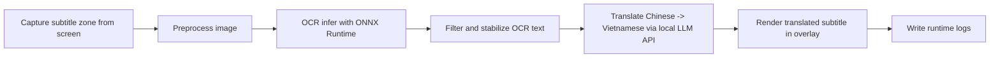
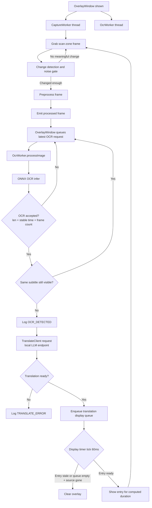

# ScreenSubTranslator

ScreenSubTranslator is a Qt6 desktop overlay tool that captures an on-screen subtitle zone, runs local Chinese OCR with Paddle-style ONNX models in C++, translates to Vietnamese using a local LLM endpoint (llama.cpp/Ollama/OpenAI-compatible local API), and renders the translation over video in near real time.

## Demo (Placeholder - Add Media Later)

Use this section as the fixed place to add your demo assets.

### Screenshot

<!-- Replace with your real screenshot path -->


### Video

<!-- Replace with your real video URL or local file link -->
[Demo Video Placeholder](https://example.com/replace-with-your-demo-video)

## Architecture

- Qt6 transparent overlay window (always-on-top, draggable, resizable)
- Capture worker in a dedicated thread
- OCR worker in a dedicated thread
- Subtitle logger in a dedicated thread
- OCR engine: ONNX Runtime C++ API (no Python, no Tesseract)
- Translation client: local LLM HTTP API only
- Runtime subtitle logs: `test/subtitles/chinese.srt`, `test/subtitles/vietnamese.srt`
- Debug runtime event log: `test/subtitle_log.txt` (Debug build only)

### End-to-End Pipeline (Capture -> OCR -> Translate -> Render)



Pipeline notes:

- Image preprocessing includes text-region crop + aspect-ratio-preserving resize + padding to OCR input size.
- OCR text is accepted only when debounce/stability gates pass (length, stable time, seen frames).
- OCR noise-gate parameters are centralized in `src/tuning_params.h` (single fixed configuration, currently aligned with the previous Balanced tuning).
- Subtitle dedupe gate suppresses repeated dispatch while the same subtitle is still on screen.
- Translation is async; stale/error events are handled without freezing the overlay.
- Translations are buffered in a display queue and shown sequentially with per-entry timing.

## Features

- Red scan frame with drag/resize from edges and corners
- Translation bubble auto-resizes and stays inside frame
- Translation placement selectable above or below source subtitle
- Adaptive capture loop for lower latency
- Noise filtering (frame diff ratio + contrast gate)
- OCR debounce and stabilization filters
- Right-click menu:
  - Translation Position (above/below)
- Hotkeys:
  - `Alt+T`: toggle translation position
- Fixed OCR noise configuration at startup (equivalent to previous Balanced values)

## Requirements

- Linux desktop environment (tested on Ubuntu)
- CMake 3.16+
- C++17 compiler
- Qt6 Widgets + Concurrent + Network
- OpenCV 4.x
- ONNX Runtime C++
- SentencePiece C++ library (`libsentencepiece-dev`)
- NVIDIA driver + CUDA + cuDNN (required only if you enable CUDA OCR provider)

## Install System Dependencies (Ubuntu)

```bash
sudo apt update
sudo apt install -y build-essential cmake git wget tar
sudo apt install -y qt6-base-dev libopencv-dev libsentencepiece-dev
```

## Install ONNX Runtime C++

1. Download ONNX Runtime Linux package (CPU or GPU) from official releases.
2. Extract to a fixed directory, for example `/opt/onnxruntime-linux-x64-gpu`.
3. Export root path for CMake discovery:

```bash
export ONNXRUNTIME_ROOT=/opt/onnxruntime-linux-x64-gpu
```

(Optional) persist in shell profile:

```bash
echo 'export ONNXRUNTIME_ROOT=/opt/onnxruntime-linux-x64-gpu' >> ~/.zshrc
source ~/.zshrc
```

If you use GPU package, also export runtime library path:

```bash
export LD_LIBRARY_PATH=/opt/onnxruntime-linux-x64-gpu/lib:$LD_LIBRARY_PATH
```

## Prepare OCR Model Files

The `models/` directory is intentionally gitignored, so model files are not included in this repository.
You must download and place PaddleOCR model assets manually before running the app.

Place OCR model assets at:

```text
models/paddle/
├── ch_PP-OCRv4_rec_infer.onnx
└── ppocr_keys_v1.txt
```

Create the directory:

```bash
mkdir -p models/paddle
```

Download model files:

1. Download PaddleOCR recognition ONNX model (`ch_PP-OCRv4_rec_infer.onnx`).
2. Download matching character dictionary (`ppocr_keys_v1.txt`).

You can obtain both files from PaddleOCR official release resources or trusted mirrors, then copy them into `models/paddle/`.

Quick verification:

```bash
ls -lh models/paddle/ch_PP-OCRv4_rec_infer.onnx models/paddle/ppocr_keys_v1.txt
```

Default paths are configured in `src/tuning_params.h`.

## Prepare Local Translation Backend (Required)

The app now uses local translation only.

### Option A: llama.cpp server

```bash
~/llama.cpp/build/bin/llama-server \
  -m /path/to/Qwen2.5-7B-Instruct-Q4_K_M.gguf \
  --host 127.0.0.1 --port 8080 \
  -ngl 99
```

Health check:

```bash
curl http://127.0.0.1:8080/health
```

### Option B: Ollama

Run Ollama separately (default port `11434`), then set API mode/base URL accordingly.

### Option C: OpenAI-compatible local endpoint

Use any local server exposing `/v1/chat/completions`.

### Runtime environment overrides

```bash
export SST_LLAMA_BASE_URL=http://127.0.0.1:8080
export SST_LLAMA_MODEL=qwen2.5:7b-instruct-q4_K_M
export SST_LLM_API=llamacpp   # auto | llamacpp | openai | ollama
export SST_TRANSLATE_CONTEXT_FILE=../translate/movie_context.txt
export SST_TRANSLATE_GLOSSARY_FILE=../translate/glossary.json
```

`SST_LLM_API=auto` resolution behavior:

- Base URL contains `:11434` or `/api` -> treat as Ollama API
- Base URL contains `/v1` -> treat as OpenAI-compatible API
- Otherwise -> treat as llama.cpp completion API

## Glossary For Proper Names (Han-Viet)

To stabilize person/place names (for example `Guangxi -> Quảng Tây`, `Chongqing -> Trùng Khánh`, `田汉 -> Điền Hán`), use `translate/glossary.json`.

Supported format:

```json
{
  "glossary": {
    "田汉": {
      "target": "Điền Hán",
      "aliases": ["Tian Han", "Tan Han", "Tán Han"]
    },
    "广西": {
      "target": "Quảng Tây",
      "aliases": ["Guangxi"]
    },
    "重庆": "Trùng Khánh"
  },
  "aliases": {
    "Chongqing": "Trùng Khánh"
  }
}
```

Behavior:

- Glossary entries are injected into LLM prompt context.
- Alias normalization is applied after translation sanitization.
- Longer aliases are prioritized first to reduce partial replacement issues.

## Translation Guardrails (Current)

Implemented in `src/translate_client.cpp`:

- Reject obvious non-Chinese OCR candidates before translation request.
- Sanitize raw model output (labels, Han remnants, punctuation noise, spacing noise).
- Post-process noisy artifacts from local LLM generations.
- Reject suspicious outputs:
  - English-heavy output
  - Over-expanded translation for very short source phrase
  - Suspiciously short translation
- Force one complete-line retry when first output is suspiciously short.
- Optional additional repair/rescue passes are controlled by `kEnableRetryPasses`.

Current default in `src/tuning_params.h`:

- `kEnableRetryPasses = false`

## Translation Display Queue

Translated subtitles are buffered and rendered sequentially to preserve timing quality.

How it works:

1. Each completed translation is enqueued with timestamp.
2. `tickDisplayQueue()` runs every `kDisplayTickMs`.
3. Display duration per entry:

$$
\text{duration} = \text{clamp}\left(\text{kDisplayBaseMs} + \text{charCount} \times \text{kDisplayMsPerChar},\ \text{kDisplayMinMs},\ \text{kDisplayMaxMs}\right)
$$

4. Stale queue entries (`> kDisplayMaxLatencyMs`) are dropped.
5. If queue size reaches `kDisplayQueueMaxSize`, queue is flushed to prioritize newest subtitle.
6. When queue is empty and source subtitle has disappeared, overlay is cleared.

Current defaults (`src/tuning_params.h`):

| Parameter | Default | Description |
| --- | --- | --- |
| `kDisplayMinMs` | 300 ms | Minimum display duration per entry |
| `kDisplayMaxMs` | 3000 ms | Maximum display duration per entry |
| `kDisplayBaseMs` | 250 ms | Base duration before per-character contribution |
| `kDisplayMsPerChar` | 70 ms | Added ms per displayed character |
| `kDisplayMaxLatencyMs` | 2500 ms | Drop entry if queued longer than this |
| `kDisplayQueueMaxSize` | 5 | Max queue depth before overflow flush |
| `kDisplayTickMs` | 60 ms | Display timer interval |

## Build

By default, CMake sets `Release` if `CMAKE_BUILD_TYPE` is not specified.

```bash
mkdir -p build
cd build
cmake .. -DCMAKE_BUILD_TYPE=Release
cmake --build . -j"$(nproc)"
```

Optional debug-image capture build:

```bash
mkdir -p build-debug-images
cd build-debug-images
cmake .. \
  -DCMAKE_BUILD_TYPE=RelWithDebInfo \
  -DSST_ENABLE_CAPTURE_DEBUG_IMAGES=ON
cmake --build . -j"$(nproc)"
```

Debug build with runtime event log enabled:

```bash
mkdir -p build-debug
cd build-debug
cmake .. -DCMAKE_BUILD_TYPE=Debug
cmake --build . -j"$(nproc)"
```

Useful CMake options:

| Option | Default | Description |
| --- | --- | --- |
| `CMAKE_BUILD_TYPE` | `Release` | Build mode (`Debug`, `Release`, `RelWithDebInfo`, `MinSizeRel`) |
| `SST_ENABLE_CAPTURE_DEBUG_IMAGES` | `OFF` | Save CaptureWorker debug preprocessed images at runtime |
| `ONNXRUNTIME_ROOT` (env) | empty | Root path used by CMake to locate ONNX Runtime |

Notes:

- `test/subtitles/chinese.srt` and `test/subtitles/vietnamese.srt` are generated in every build type.
- `test/subtitle_log.txt` is generated only when building with `-DCMAKE_BUILD_TYPE=Debug` on Ubuntu single-config generators such as Ninja or Unix Makefiles.

## Run

```bash
cd build
./ScreenSubTranslator
```

## Validate CUDA OCR Runtime (Optional)

When `kUseCudaExecutionProvider = true`, OCR engine attempts CUDA EP first.

Quick checks:

```bash
nvidia-smi
ldd ./ScreenSubTranslator | grep onnxruntime
```

If CUDA EP is unavailable, runtime falls back to CPU with warning logs.

## OCR Batch Evaluation

```bash
cd build
./OcrBatchEval
```

`OcrBatchEval` uses paths relative to the build directory:

- image directory: `../test/image`
- zh labels: `../test/image/image_sub.txt`
- vi labels (optional): `../test/image/image_sub_vi.txt`
- debug preprocessed output: `../test/image/debug_preprocessed`
- translation report: `../test/image/translation_eval.txt`

Important note:

- `OcrBatchEval` currently uses legacy ONNX translator assets from `../models/translate` (`encoder_model.onnx`, `decoder_model.onnx`, `source.spm`, `target.spm`, `vocab.json`).
- This is separate from runtime overlay translation, which now uses local LLM HTTP API.

## Current Runtime Flow



## File Responsibilities

| File | Responsibility |
| --- | --- |
| `main.cpp` | Create `QApplication`, start `OverlayWindow`, run app loop |
| `src/overlay_window.h/.cpp` | Overlay UI, drag/resize scan frame, worker wiring, OCR acceptance gate, translation queue display, runtime logging |
| `src/capture_worker.h/.cpp` | Capture scan region, change/noise gate, preprocess image for OCR |
| `src/ocr_worker.h/.cpp` | Worker-thread bridge: receive frame, call OCR engine, emit result/error |
| `src/ocr_engine.h/.cpp` | ONNX Runtime OCR session, charset loading, inference, text normalization |
| `src/translate_client.h/.cpp` | Async Chinese->Vietnamese translation through local LLM HTTP API (llama.cpp/Ollama/OpenAI-compatible local endpoint) |
| `src/tuning_params.h` | Central tuning constants (OCR, profiles, dedupe, translation queue, local LLM defaults) |
| `tools/ocr_batch_eval.cpp` | Offline OCR + translation evaluator for labeled samples in `test/image` |
| `translate/glossary.json` | Glossary and alias normalization rules for proper names |
| `translate/movie_context.txt` | Optional movie context injected into translation prompts |

## Logging

Runtime log files:

- `test/subtitles/chinese.srt`
- `test/subtitles/vietnamese.srt`
- `test/subtitle_log.txt` (Debug build only)

Main log event types currently emitted:

| Event | Description |
| --- | --- |
| `SESSION_START` | Application started |
| `OCR_DETECTED` | OCR candidate accepted and dispatched to translator |
| `OCR_ROLLBACK` | Candidate fallback to stronger OCR variant |
| `OCR_ERROR` | OCR worker error |
| `TRANSLATED` | Translation received |
| `TRANSLATE_ERROR` | Translation failure/rejection |
| `POSITION_CHANGED` | Translation position changed from menu |
| `POSITION_TOGGLED` | Translation position toggled by hotkey |
| `DISPLAY_DROPPED_STALE` | Queue entry dropped due to max latency |
| `DISPLAY_CLEARED` | Overlay cleared when source gone and queue empty |

The `.srt` files are emitted in both Debug and Release builds. Runtime subtitle logging is handled by a dedicated background logger thread so file I/O does not run on the overlay UI thread.

## Project Structure (Current Workspace)

```text
screen_sub_translate/
├── CMakeLists.txt
├── main.cpp
├── README.md
├── src/
│   ├── capture_worker.h
│   ├── capture_worker.cpp
│   ├── ocr_engine.h
│   ├── ocr_engine.cpp
│   ├── ocr_worker.h
│   ├── ocr_worker.cpp
│   ├── overlay_window.h
│   ├── overlay_window.cpp
│   ├── subtitle_logger.h
│   ├── subtitle_logger.cpp
│   ├── translate_client.h
│   ├── translate_client.cpp
│   └── tuning_params.h
├── test/
│   ├── subtitle_log.txt
│   ├── subtitles/
│   │   ├── chinese.srt
│   │   └── vietnamese.srt
│   ├── terminal_log.txt
│   ├── video_test_sub.txt
│   └── image/
├── translate/
|   ├── glossary.json
|   └── movie_context.txt
└── models/paddle/
    ├── ch_PP-OCRv4_rec_infer.onnx
    └── ppocr_keys_v1.txt
```
